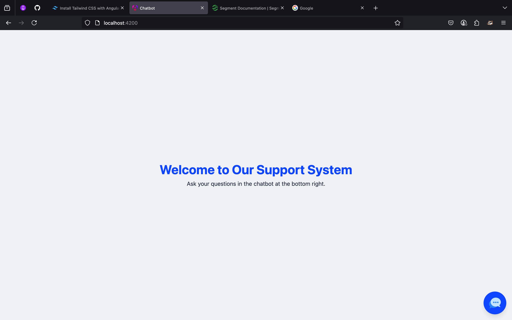
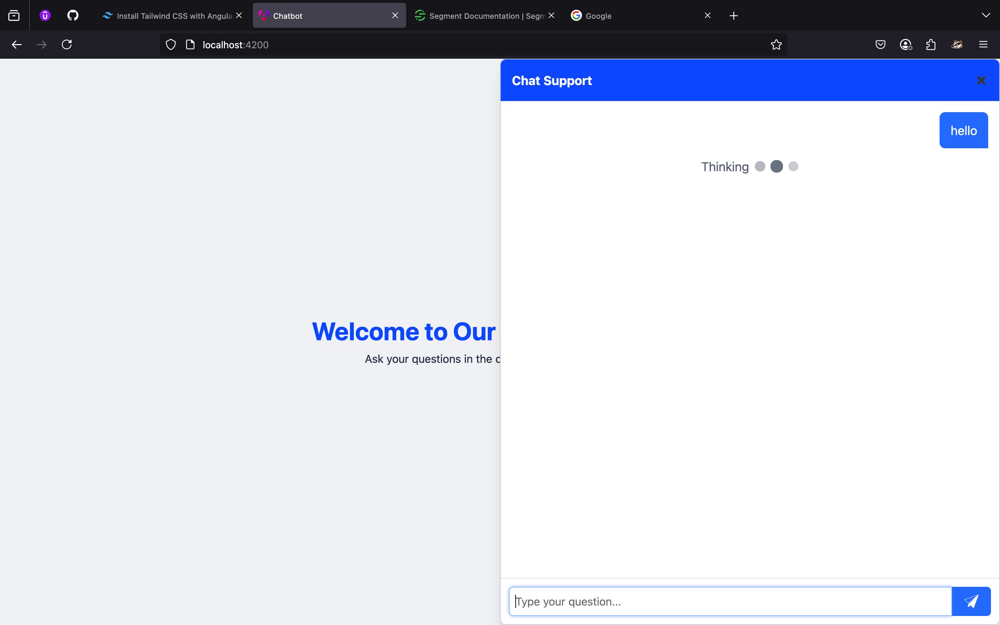
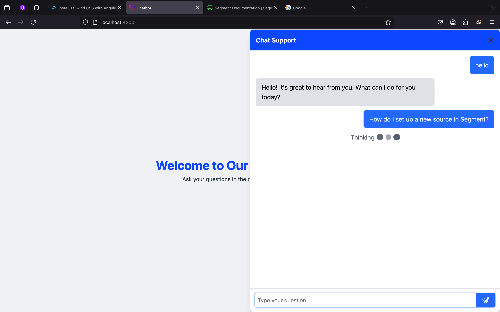
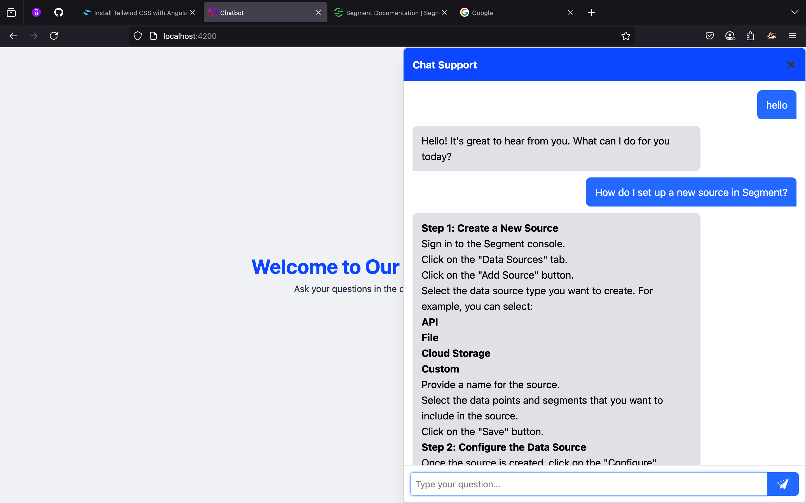

## Chatbot Assignment (Using Ollama)

This project is chatbot for support using 
1. Ollama, 
2. Angular - for frontend, and 
3. Flask - for Backend

Some screenshots






## Getting started
This is the project that is made using two components (backend and frontend). To get this running follow below steps

1. Software Requirements
   1. `nodejs - v18.20.4`
   2. `docker - v27.4.0`
   3. `python - v3.10`
2. Get ollama installed and running
   - to get `Ollama` running follow below steps
     1. pull ollama docker image and run it in container
     2. pull pull gemma:2b
   
   ```shell
   docker run -d --name ollama -p 11434:11434 ollama/ollama
   ```
   ```shell
   docker exec -it ollama bash
   ```
   ```shell
   ollama pull gemma:2b
   ```   
   ```shell
   exit
   ```
   ```shell
   docker restart ollama
   ```
   
> After these steps you'll have your model step :)
      
First of all clone this repository

```shell
git clone https://github.com/abhijeet-Bh/chatbot.git
cd chatbot
```

3. Now, Let's start our backend
    
   - To start our backend, follow these steps
   
   ```shell
    cd chatbot-backend
    python -m venv venv
    source venv/bin/activate   # On Windows: venv\Scripts\activate
   ```
   
   ```shell
    pip install -r requirements.txt
   ```
   
   ```shell
    python app.py #or python3 app.py (on mac)
   ```

4. Now, let's start our frontend

    - To start our frontend, follow these steps

   ```shell
    cd chatbot-frontend
   ```

   ```shell
    npm install
   ```

   ```shell
    ng serve
   ```
   
> After this the `frontend`, `backend` and the `ollama` will be running

Now, go to your browser and visit address `http://localhost:4200/`, you'll find the webpage of chatbot :)